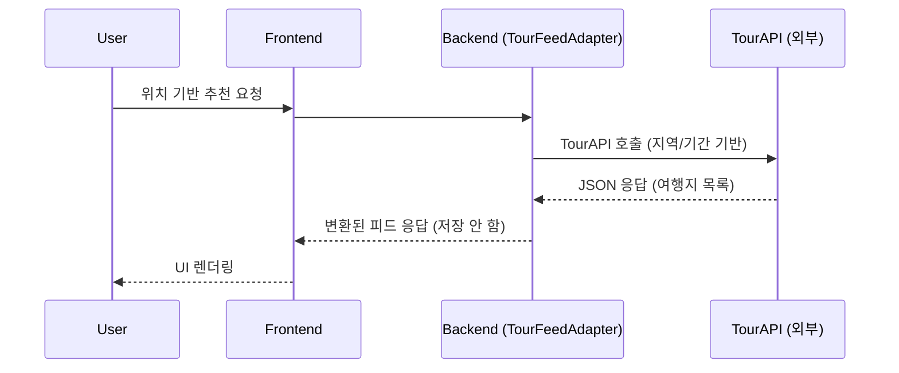
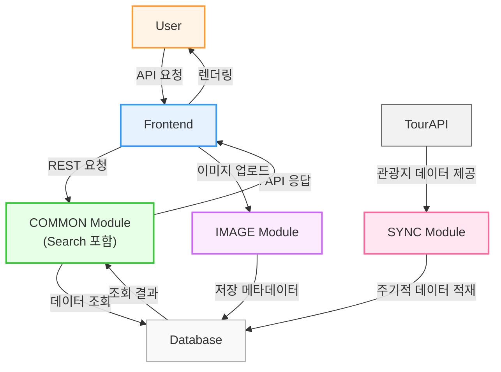
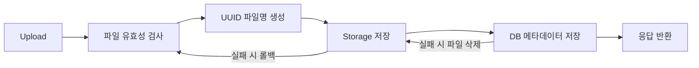

## Hipstour란

Hipstour(힙스투어)는 사용자의 여행 성향을 고려하여  
개인에게 맞는 여행지를 추천하는 SNS형 여행 플랫폼입니다.  

- **서비스 목적:** 사용자 성향 기반 맞춤형 여행지 추천  
- **핵심 기능:** 여행지 피드,  성향 분석, 여행지 등록  
- **기술 스택:** Java / Spring Boot / JPA / Gradle / MySQL  
- **역할:** 백엔드 담당

---

## Hipstour 전체적인 설계도 및 개략적인 설명

###  전체 시스템 개요

Hipstour는 **멀티 모듈 구조**를 기반으로 설계되어 있습니다.  
각 기능 단위를 독립 모듈로 분리하여 유지보수성과 확장성을 확보했습니다.

###  시스템 플로우



###  주요 기능 및 모듈 설명

- common 사용자, 장소, 리뷰등 담당  
- Search  (검색 로직 최적화)
- ImageUpload  (이미지 파일 저장·조회)
- Sync TourAPI의 장소 데이터를 주기적으로 동기화


### 모듈 구조도

---


## 내가 맡은 업무

###  Search 모듈

####  개요

Hipstour의 검색 기능은 사용자의 입력 키워드를 기반으로  
여행지 데이터에서 부분 일치 검색을 수행하는 모듈입니다.  
검색 결과는 최신순 또는 좋아요순으로 정렬 가능하며, 페이지네이션이 적용됩니다.

#### 흐름도


####  문제 해결 및 개선

**문제**   
- 프론트 요구(다중 정렬, 페이징)에 따른 로직 분산
- 페이지네이션 일관성이 모듈마다 달라 프론트에서 적용 어려움
- 응답 구조가 통일되지 않아 React에서 매번 별도 파싱 로직 작성 필요

**해결**
-  공통 페이징 DTO 도입 (형식 통일)
```java
public class PageResponseDto<T> {
    private final List<T> content;
    private final int pageNumber;
    private final int pageSize;
    private final long totalElements;
    private final int totalPages;
    private final boolean first;
    private final boolean last;

    private PageResponseDto(List<T> content, Page<?> page) {
        this.content = content;
        this.pageNumber = page.getNumber();
        this.pageSize = page.getSize();
        this.totalElements = page.getTotalElements();
        this.totalPages = page.getTotalPages();
        this.first = page.isFirst();
        this.last = page.isLast();
    }

    public static <E, T> PageResponseDto<T> fromPage(Page<E> page, Function<E, T> converter) {
        List<T> content = page.getContent().stream()
                .map(converter)
                .collect(Collectors.toList());
        return new PageResponseDto<>(content, page);
    }
}
```
#### 효과
프론트는 **pagination 객체는 항상 동일한 구조** 라는 전제를 가짐
→ 유지보수 난이도 하락

#### 배운 점
- 협업시 응답구조을 통일해야 프론트에서 하나의 로직으로 재사용이 쉬움
- 수정 및 추가할때 응답dto만 변경하면 되니 유지보수 와 확장성이 좋음

---

### 이미지 모듈

#### 개요
Hipstour 내에서 여행지 및 리뷰 이미지를 업로드하고 관리하는 모듈입니다.  
여러 장의 이미지를 업로드할 수 있으며, 각 여행지마다 1개의 **대표 이미지**를 랜덤으로 노출합니다.

#### 흐름도


#### 문제 해결 및 개선

**문제**
- 다중 업로드 시 파일명 충돌
- 확장자 위장 업로드(보안 리스크)
- DB 저장은 성공했는데 파일 저장 실패 → orphan file 생성
- S3 전환 요구 발생 시 구조 변경이 어려움

  
**해결**

-매직넘버 기반 파일 유효성 검사
```java
public static void validate(MultipartFile file) {
        if (file.isEmpty()) {
            throw new IllegalArgumentException("파일이 비어 있습니다.");
        }

        if (!isValidExtension(file.getOriginalFilename())) {
            throw new IllegalArgumentException("허용되지 않는 파일 형식입니다.");
        }

        if (file.getSize() > ImageValidationConstants.MAX_FILE_SIZE) {
            throw new IllegalArgumentException("파일 크기가 5MB를 초과합니다.");
        }
        try {
            if (!hasValidMagicNumber(file.getBytes()))
                throw new IllegalArgumentException("실제 이미지가 아닙니다.");
        } catch (IOException e) {
            throw new IllegalArgumentException("파일 검사 중 오류가 발생했습니다.");
        }
    }
```


- 확장자 검사
```java
public static boolean isValidExtension(String fileName) {
        if (fileName == null || !fileName.contains(".")) return false;
        String ext = fileName.substring(fileName.lastIndexOf('.')+1).toLowerCase(); //확장자 추출
        return ImageValidationConstants.ALLOWED_EXTENSIONS.contains(ext);
    }
```

- DB 저장/파일 저장 정합성 처리(파일 실패 시 롤백, DB 실패 시 파일 삭제)
```java
try {
        //전처리
        byte[] processed = ImageProcessor.processToJpg(file);

        //전처리 후의 파일저장
        path = imageStorage.save(processed , storedName);

        //db저장
        ImageEntity entity = new ImageEntity();
        entity.setOriginalName(file.getOriginalFilename());
        entity.setStoredName(storedName);
        entity.setPath(path);
        entity.setCreatedAt(LocalDateTime.now());

        return imageRepository.save(entity);
    } catch (IOException e) {
        log.error("이미지 저장 중 오류 발생: {}", e.getMessage(), e);

        //파일 생성 후 db저장에 실패
        if (path != null) {
            try {
                imageStorage.delete(path);
                log.warn("저장 실패한 파일 삭제 : {}", path);
            } catch (IOException ignored) {
                log.error("파일 삭제 실패 - {}", e.getMessage(), e);
            }
        }
    }
    throw new RuntimeException("파일 업로드에 실패했습니다.");
```

- ImageStorage 인터페이스 도입(로컬/S3 구현체 분리) — 확장성 확보
```java
public class ImageService {
     public ImageService(ImageRepository imageRepository, ImageStorage imageStorage){
        this.imageRepository = imageRepository;
        this.imageStorage = imageStorage;
    }
}
```
public interface ImageStorage extends Closeable {
    String save(MultipartFile file, String storedName) throws IOException;
    String save(byte[] bytes, String storedName) throws IOException;
    void delete(String fullPath) throws IOException;
    boolean exists(String fullPath);
}


#### 효과

- 업로드 에러 시 orphan 파일 발생률 0%(롤백 처리)
- 매직넘버 기반 검증 도입으로 확장자 위장 공격 차단
- Local / S3 교체 가능 구조

#### 배운점
- 단순히 파일 업로드 기능을 구현하는 것을 넘어, 외부 리소스(DB-파일시스템 간)의 정합성, 보안 검증, 그리고 구조적 확장성의 중요성
-“파일만 저장되면 된다”는 단순 사고는 위험함
- 트랜잭션 범위 내에서 예외 처리를 명확히 하고, 추상화 계층을 도입함으로써 부분성공 상태가 발생하지 않아 디버깅이 더 쉬움


---


###  Gradle 병합 (Multi-Module 설정 통합)

#### 개요
Hipstour 프로젝트는 `common`, `ImageUpload`, `sync`, `util` 등 여러 모듈로 구성되어 있으며  
초기에는 각 모듈별로 공통 dependency 설정이 중복되는 문제가 있었습니다.  
이를 해결하기 위해 **Gradle 설정 통합 및 구조 개선 작업**을 수행했습니다.

#### 문제 해결 및 개선

**문제**

-각 모듈마다 동일 dependency를 반복 선언
-Groovy/Kotlin DSL 혼합으로 인해 빌드 환경 불안정
-공통 설정 변경 시 모든 모듈의 build.gradle 수정 필요


**해결**

-buildSrc + Custom Plugin 적용

프로젝트 구조
```css
buildSrc/
 └── src/main/kotlin/
      └── CommonConventionPlugin.kt
```

플러그인 코드
```Kotlin
class CommonConventionPlugin : Plugin<Project> {
    override fun apply(project: Project) {
        //플러그인이 적용된 모듈에서 실행됨

        project.group = "com.project.hiptour"
        project.version = "0.0.1-SNAPSHOT"

        project.plugins.apply("java")
        // Java 버전 17
        project.extensions.configure(JavaPluginExtension::class.java) {
            sourceCompatibility = JavaVersion.VERSION_17
            targetCompatibility = JavaVersion.VERSION_17
        }
```

모듈적용
```Kotlin
plugins {
	id("common-convention")
}
```

#### 효과

| 구분 | Before | After |
|------|------------|------------|
| 설정 관리 | 모둘별 중복 | `buildSrc` 에서 단일관리 |
| DSL | Groovy + Kotlin 혼용 | Kotlin DSL 통일 |
| 일관성 | 낮음 | 높음 |
| 유지보수 | 변경 시 모든 모듈 수정 | buildSrc에서 일괄 관리 가능 |


#### 배운 점
- Gradle 설정 자체도 하나의 **아키텍처 구성요소**로 관리해야 함  
- DSL 혼합으로 인한 빌드 오류는 단순한 문법 문제가 아님  
  → **설계 일관성 유지의 중요성 체감**  
- buildSrc 방식은 실무 멀티모듈 환경에서도 매우 실용적임(공식문서 참고)  

---

### 개선작업이 프로젝트 전체에 미친 영향
- 검색/이미지/설정 모두 확장성과 안정성을 우선한 구조로 개선
- 프론트 응답 구조 통일로 협업 생산성 증가
- 파일/DB 정합성 확보로 서비스 안정성 강화
- 멀티모듈 설정 통합으로 빌드 속도 및 관리 효율 향상


**마무리**  
> 단순 기능 구현이 아닌 아키텍처적 문제 해결 → 구조적 개선 → 협업 개선까지 경험할 수 있었던 값진 작업이었습니다.
> 협업 작업을 하며, 다른분의 코드 구조를 보며 통일화나 유지보수를 생각하고 작업한게 색다른 경험이었고, 추후 다시 협업할땐 해당사항을 고려하며 더 잘 할 수 있을 것 같다는 생각을 했습니다. 
