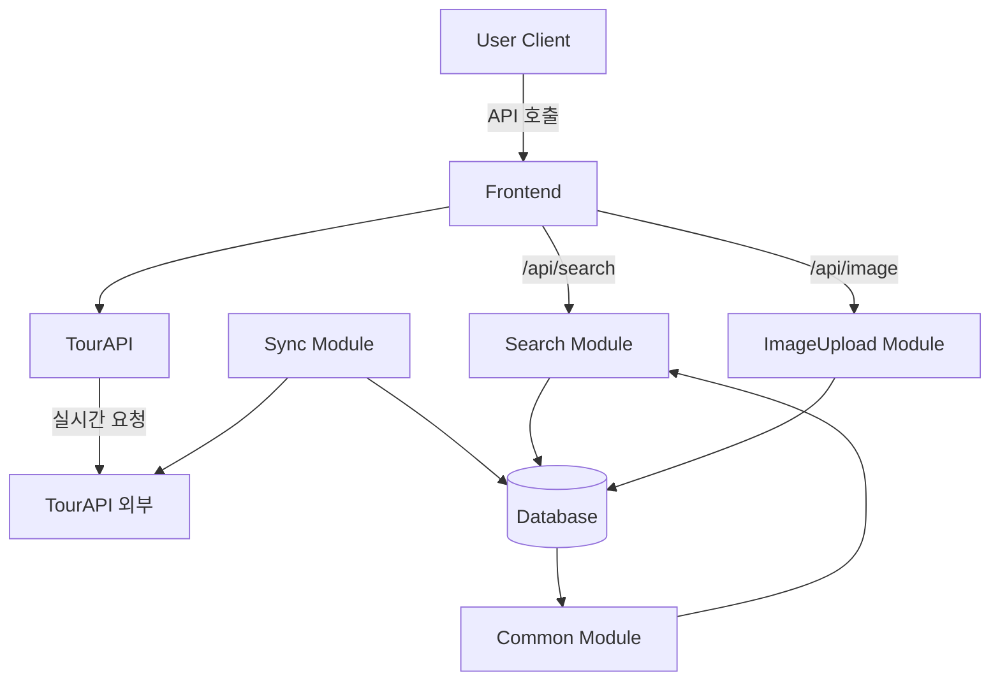
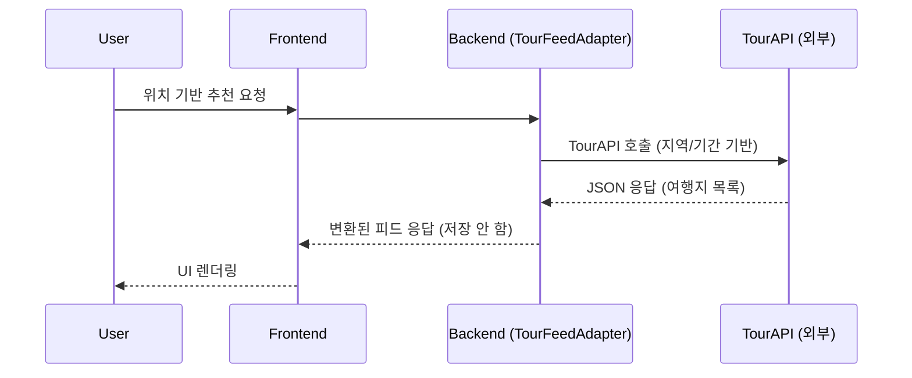

# Hipstour
**역할:** 백엔드 개발  
**프로젝트명:** Hipstour  
**한줄 소개:** 성향 기반 개인 맞춤형 여행지 추천 SNS 플랫폼

---

## 1. Hipstour란

Hipstour(힙스투어)는 **사용자의 여행 성향과 실제 현지인의 경험을 결합**하여  
개인에게 맞는 여행지를 추천하는 SNS형 여행 플랫폼입니다.  

- **서비스 목적:** 사용자 성향 기반 맞춤형 여행지 추천  
- **핵심 기능:** 여행지 피드, 리뷰, 성향 분석, 여행지 등록  
- **기술 스택:** Java / Spring Boot / JPA / Gradle / MySQL  
- **역할:** 백엔드 담당  

---

## 2. Hipstour 전체적인 설계도 및 개략적인 설명

###  전체 시스템 개요

Hipstour는 **멀티 모듈 구조**를 기반으로 설계되어 있습니다.  
각 기능 단위를 독립 모듈로 분리하여 유지보수성과 확장성을 확보했습니다.

###  주요 모듈 설명

- common 사용자, 장소, 리뷰등 담당  
- Search  (검색 로직 최적화)
- ImageUpload  (이미지 파일 저장·조회)
- Sync TourAPI의 장소 데이터를 주기적으로 동기화

### 시스템 컴포넌트 다이어그램

###  시스템 플로우

---

## 3.내가 맡은 업무

### 1. Search 모듈

#### 1-1. 개요

Hipstour의 검색 기능은 사용자의 입력 키워드를 기반으로  
여행지 데이터에서 부분 일치 검색을 수행하는 모듈입니다.  
검색 결과는 최신순 또는 좋아요순으로 정렬 가능하며, 페이지네이션이 적용됩니다.

#### 1-2. 문제 해결 및 개선

**문제**   
- 프론트 요구(다중 정렬, 페이징)에 따른 로직 분산

**해결**
-  공통 페이징 응답 DTO 도입 (형식 통일)

#### 1-3. 배운 점
- 협업시 응답구조을 통일해야 프론트에서 하나의 로직으로 재사용이 쉬움
- 수정 및 추가할때 응답dto만 변경하면 되니 유지보수 와 확장성이 좋음

---

### 2. 이미지 모듈

#### 2-1. 개요
Hipstour 내에서 여행지 및 리뷰 이미지를 업로드하고 관리하는 모듈입니다.  
여러 장의 이미지를 업로드할 수 있으며, 각 여행지마다 1개의 **대표 이미지**를 랜덤으로 노출합니다.

#### 2-2. 문제 해결 및 개선

**문제**
- 다중 업로드 시 파일명 충돌
- 확장자 위장 업로드(보안 리스크)
- DB와 파일시스템 불일치(오류 발생 시 orphan file)
- 유지보수및 확장성에 대한 고민

**해결**
- UUID 기반 파일명 규칙 + 중복 체크 로직 추가  
- @Transactional 범위 내에서 DB 저장/파일 저장 정합성 처리(파일 실패 시 롤백, DB 실패 시 파일 삭제)
- ImageStorage 인터페이스 도입(로컬/S3 구현체 분리) — 확장성 확보

**효과**
- 업로드 에러 시 orphan 파일 발생률 없음(롤백 처리)
- 매직넘버 기반 검증 도입으로 확장자 위장 공격 차단

**배운점**
- 단순히 파일 업로드 기능을 구현하는 것을 넘어, 외부 리소스(DB-파일시스템 간)의 정합성, 보안 검증, 그리고 구조적 확장성의 중요성
- 트랜잭션 범위 내에서 예외 처리를 명확히 하고, 추상화 계층을 도입함으로써 부분성공 상태가 발생하지 않아 디버깅이 더 쉬움

---

### 3. Gradle 병합 (Multi-Module 설정 통합)

#### 3-1. 개요
Hipstour 프로젝트는 `common`, `ImageUpload`, `sync`, `util` 등 여러 모듈로 구성되어 있으며  
초기에는 각 모듈별로 공통 dependency 설정이 중복되는 문제가 있었습니다.  
이를 해결하기 위해 **Gradle 설정 통합 및 구조 개선 작업**을 수행했습니다.

#### 3-2. 구조 전후 비교

| 구분 | 기존 방식 | 개선 방식 |
|------|------------|------------|
| 설정 관리 | 각 모듈 내 `config.gradle.kts` | `buildSrc` + Custom Plugin |
| DSL 혼합 | Groovy + Kotlin 혼용 | Kotlin DSL 통일 |
| 중복 의존성 | 다수의 중복 dependency | 공통 관리 클래스에서 일원화 |
| 유지보수 | 변경 시 모든 모듈 수정 | buildSrc에서 일괄 관리 가능 |

#### 3-3. 배운 점
- Gradle 설정 자체도 하나의 **아키텍처 구성요소**로 관리해야 함  
- DSL 혼합으로 인한 빌드 오류는 단순한 문법 문제가 아님  
  → **설계 일관성 유지의 중요성 체감**  
- buildSrc 방식은 실무 멀티모듈 환경에서도 매우 실용적임(공식문서 참고)  

---

>  **정리:**  
> Search, 이미지, Gradle — 세 모듈 모두 확장성과 유지보수성을 중심으로 구현 및 리팩토링을 진행했습니다.  
> 협업 작업을 하며, 다른분의 코드 구조를 보며 통일화나 유지보수를 생각하고 작업한게 색다른 경험이었고, 추후 다시 협업할땐 해당사항을 고려하며 더 잘 할 수 있을 것 같다는 생각을 했습니다. 
